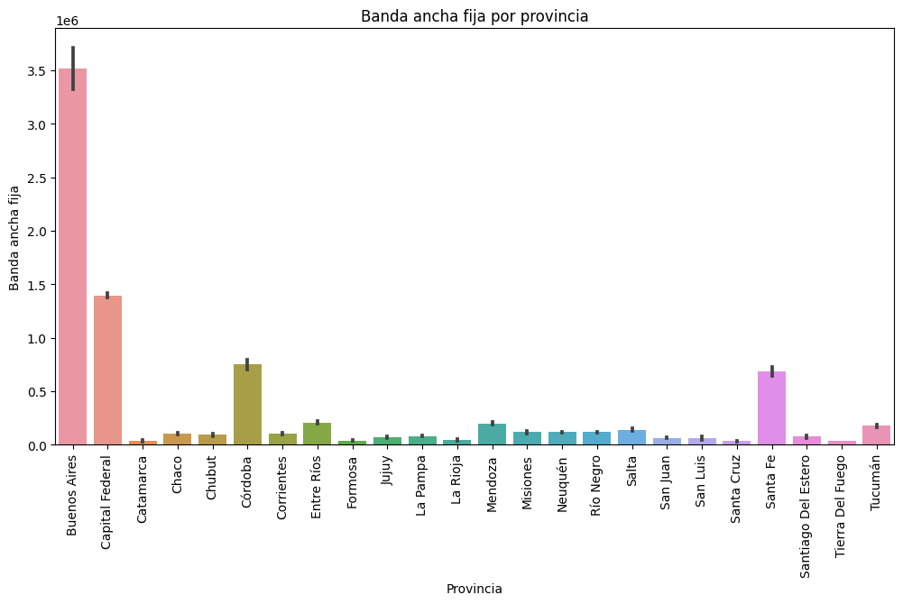
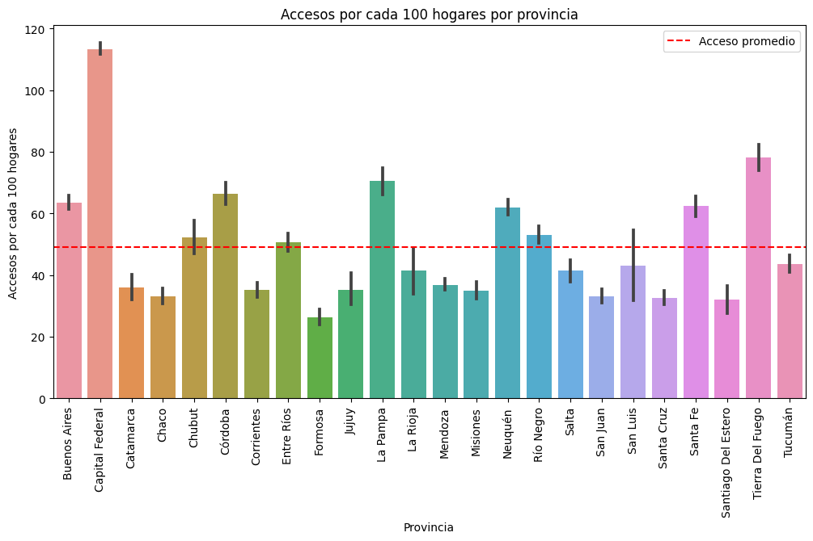
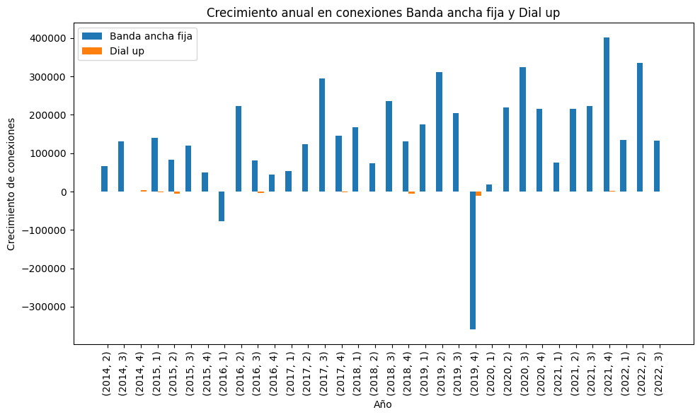

# PROYECTO INTEGRADO Nro 2

## ANÁLISIS DE SERVICIO DE INTERNET EN EL TERRITORIO NACIONAL

Este proyecto presenta un análisis detallado del comportamiento del servicio de internet en Argentina desde el año 2014 hasta 2022. Se examinan aspectos clave como la cobertura del servicio, protocolos de conexión y disponibilidad del mismo.

### OBJETIVOS

- Realizar una Extracción, Transformación y Carga (ETL) de la información suministrada en el siguiente enlace: [https://www.enacom.gob.ar/](https://www.enacom.gob.ar/).
- Realizar un análisis gráfico sobre el servicio de internet en Argentina.
- Crear un Control de Mando (Dashboard).
- Medir Indicadores Clave de Rendimiento (KPI).

### Extracción de la información y EDA

En el archivo ETL-EDA.ipynb se realiza la carga, transformación y análisis preliminar de los datos. Se obtienen los siguientes conjuntos de datos desde [https://datosabiertos.enacom.gob.ar/dashboards/20000/acceso-a-internet/](https://datosabiertos.enacom.gob.ar/dashboards/20000/acceso-a-internet/):

- AccesosaInternetfijoporvelocidaddebajadaylocalidad_2776171689206806462.csv
- ConectividadalserviciodeInternet_2776151689206559167.csv
- historico_velocidad_internet.csv
- Denuncias_y_reclamos_202306.csv
- Internet_Accesos-por-tecnologia.csv
- Internet_Accesos-por-velocidad.csv
- Internet_BAF_nal.csv
- Internet_BAF_Prov.csv
- Internet_Ingresos.csv
- Internet_Penetracion_hab.csv
- Internet_Penetracion_Hogar.csv

#### Paso 1: Conocer los Datos

- Identificación del tamaño y tipo de cada conjunto de datos, y búsqueda de columnas con nombres en común.
- Renombrar columnas y corregir datos incorrectos.
- Creación de nuevos conjuntos de datos con datos en común y tamaños similares.
- Limpieza de datos erróneos y faltantes.
- Corrección de formatos incorrectos.

#### Paso 2: Preparar los Datos

- Cambio de formato de los datos incorrectos.
- Reemplazo de ',' por '.' y ajuste a formatos correctos.
- Organización de los nuevos conjuntos de datos para su almacenamiento en una base de datos MySQL.

#### Paso 3: Análisis Gráfico y Descriptivo

- Uso de la función `.describe()` para observar el comportamiento de los datos numéricos.
- Identificación de valores máximos, mínimos, media, desviación y distribución de los datos.
- Uso de la función `corr()` para observar las correlaciones entre los datos numéricos.
- Generación de diagramas de dispersión para visualizar la relación entre variables.
- Creación de histogramas para analizar la distribución y detectar sesgos.

#### Paso 4: Análisis de Cobertura y Calidad del Servicio de Internet

En este análisis se plantean las siguientes preguntas:

- ¿Cuántos hogares tienen acceso a internet?
- ¿Qué tipos de conexiones están disponibles?
- ¿Cuáles son las velocidades de descarga o conexión disponibles?
- ¿Cuántas provincias tienen acceso a internet y qué tipo de acceso tienen?
- ¿Cuál ha sido el crecimiento en el acceso a internet?
- ¿Cuál ha sido el crecimiento de las velocidades de conexión?
- ¿Cuál ha sido el crecimiento en las conexiones a internet?

Se desarrolla un Dashboard que muestra el comportamiento y la cobertura del servicio de internet en Argentina. El archivo del Dashboard es Proyecto2.pbx.

## **ANALISIS**
### **DASHBOARD**

### **BANDA ANCHA POR PROVINCIA**

### **ACCESO PROMEDIO POR PROVINCIA**

### **CRECIMIENTO DIFERENCIADO POR PERIODOS**

## *RESULTADOS DE ANALISIS*

* 1. El promedio de acceso por cada 100 hogares en el ultimo año es de 67.42 a nivel nacional 

* 2. La protocolos de conexion con mas presencia son:
    - 4G:              Presente en 2574 Provincias
    - WIRELESS:        Presente en 2242 Provincias
    - TELEFONIA FIJA:  Presente en 2162 Provincias

* 3. El 42.21% de Conexiones a Internet Estan por debajo de los 6 Mbps
    - Menor a 512Kpps : 16.11%
    - +512Kbps -1Mbps : 19.93%
    - +1Mbps -6Mbps   : 6.17%

* 4. Buenos Aires Posee La mayor cantidad de conexiones a banda ancha, pero tambien posee el mayor numero de conexiones Dial-up

* 5. Buenos Aires Tiene el mayor promedio de acceso por cada 100 hogares: 77.26 pero solo el 17.96% son conexiones mayor a 30 Mbps

* KPIS

1. Tenemos un KPI que no muestra el promedio de descarga y cuando es mayor a 20 Mbps 

2. Tenemos un Comparativo que indica las conexiones menores a 512Kpbs y su diferencia con el Total de Conexiones

3. TEnemos un Indicador de Cantidad de Localidades con Acceso a Fibra Optica con Respecto a el Total de Localidades por Provincia
